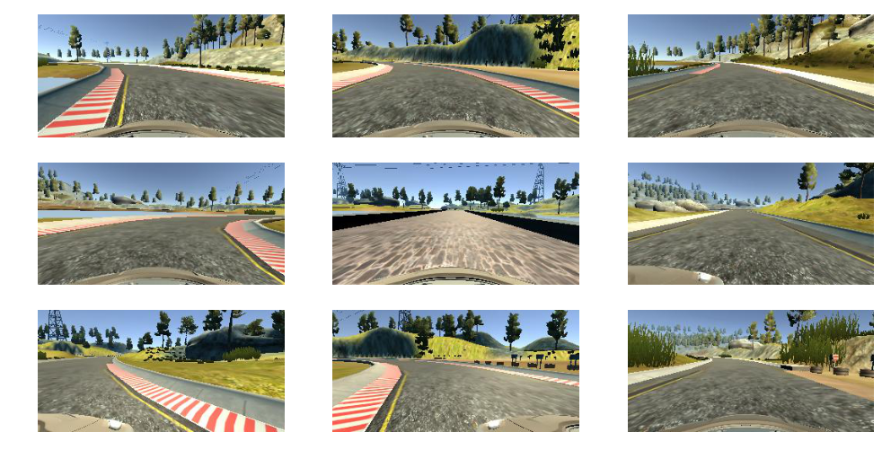

# **Behavioral Cloning** 

## Writeup Template

### You can use this file as a template for your writeup if you want to submit it as a markdown file, but feel free to use some other method and submit a pdf if you prefer.

---

**Behavioral Cloning Project**

The goals / steps of this project are the following:
* Use the simulator to collect data of good driving behavior
* Build, a convolution neural network in Keras that predicts steering angles from images
* Train and validate the model with a training and validation set
* Test that the model successfully drives around track one without leaving the road
* Summarize the results with a written report


[//]: # (Image References)

[image1]: ./examples/placeholder.png "Model Visualization"
[image2]: ./examples/placeholder.png "Grayscaling"
[image3]: ./examples/placeholder_small.png "Recovery Image"
[image4]: ./examples/placeholder_small.png "Recovery Image"
[image5]: ./examples/placeholder_small.png "Recovery Image"
[image6]: ./examples/placeholder_small.png "Normal Image"
[image7]: ./examples/placeholder_small.png "Flipped Image"

## Rubric Points
### Here I will consider the [rubric points](https://review.udacity.com/#!/rubrics/432/view) individually and describe how I addressed each point in my implementation.  

---
### Files Submitted & Code Quality

#### 1. Submission includes all required files and can be used to run the simulator in autonomous mode

My project includes the following files:
* model1.py containing the script to create and train the model
* drive.py for driving the car in autonomous mode
* model.h5 containing a trained convolution neural network 
* writeup_report.md or writeup_report.pdf summarizing the results

#### 2. Submission includes functional code
Using the Udacity provided simulator and my drive.py file, the car can be driven autonomously around the track by executing 
```sh
python drive.py model.h5
```

#### 3. Submission code is usable and readable

The model.py file contains the code for training and saving the convolution neural network. The file shows the pipeline I used for training and validating the model, and it contains comments to explain how the code works.

### Model Architecture and Training Strategy

#### 1. An appropriate model architecture has been employed
My model has 10 layers with descriptions as:
1. **Layer 1**: Conv layer with 24 5x5 filters, followed by RELU activation,
2. **Layer 2**: Conv layer with 36 5x5 filters, RELU activation
3. **Layer 3**: Conv layer with 48 5x5 filters, RELU activation, Dropout(0.4)
4. **Layer 4**: Conv layer with 64 3x3 filters, RELU activation
5. **Layer 5**: Conv layer with 64 3x3 filters, RELU activation, Dropout(0.4)
6. **Layer 6**: Fully connected layer with 1024 neurons, Dropout(0.3) and RELU activation
7. **Layer 7**: Fully connected layer with 512 neurons,
8. **Layer 8**: Fully connected layer with 128 neurons,
9. **Layer 9**: Fully connected layer with 64 neurons,
10. **Layer 10**: Fully connected layer with 1 neurons, 

#### 2. Attempts to reduce overfitting in the model

The model contains dropout layers in order to reduce overfitting in Layer 3(model.py lines 92), Layer 5(model.py lines 95), and Layer 6(model.py lines 98). 

The model was trained and validated on data sets provided by Udacity. The model was tested by running it through the simulator and ensuring that the vehicle could stay on the track.

#### 3. Model parameter tuning

Optimizer: Adam Optimizer

No. of epochs: 3

Images generated per epoch: 19286 images 

Validation Set: 4825 images

#### 4. Appropriate training data

Training data was chosen to keep the vehicle driving on the road. I used data sets(x3 i.e. 3 times of data by multiplying arrayx3) provided by Udacity for training my model for first track.

For details about how I created the training data, see the next section. 

### Model Architecture and Training Strategy

#### 1. Solution Design Approach


My first step was to use a convolution neural network model similar to the [NVIDEA paper](http://images.nvidia.com/content/tegra/automotive/images/2016/solutions/pdf/end-to-end-dl-using-px.pdf) I thought this model might be appropriate because it was one of the dense architecture for traininig neural network.So I started with 5 Conv layer and 5 fully connected layer.In the augmentation, I choose randomly  image from center, left, right
and then randomly flipping.I choose 3 epochs , and (8036*3)*0.8=19286 image per epoch to train my model based on above architecure.
After this , vehicle is able to drive autonomously around the track. I choose 3 times data set to make my model more stable 
#### 2. Final Model Architecture

The final model architecture (model.py lines 18-24) consisted of a convolution neural network with the following layers and layer sizes 

```py
model = Sequential()
model.add(Lambda(lambda x:(x/255.0)-0.5,input_shape=(160,320,3)))
model.add(Cropping2D(cropping=((70,25), (0,0))))
model.add(Convolution2D(24,5,5, subsample=(2,2), activation='relu'))
model.add(Convolution2D(36,5,5, subsample=(2,2), activation='relu'))
model.add(Convolution2D(48,5,5, subsample=(2,2), activation='relu'))
model.add(Dropout(.4))
model.add(Convolution2D(64,3,3, activation='relu'))
model.add(Convolution2D(64,3,3, activation='relu'))
model.add(Dropout(.4))
model.add(Flatten())
model.add(Dense(1024))
model.add(Dropout(0.3))
model.add(Activation('relu'))
model.add(Dense(512))
model.add(Dense(128))
model.add(Dense(64))
model.add(Dense(1))
```


```sh
Layer (type)                     Output Shape          Param #     Connected to                     
====================================================================================================
lambda_3 (Lambda)                (None, 160, 320, 3)   0           lambda_input_3[0][0]             
____________________________________________________________________________________________________
cropping2d_3 (Cropping2D)        (None, 65, 320, 3)    0           lambda_3[0][0]                   
____________________________________________________________________________________________________
convolution2d_11 (Convolution2D) (None, 31, 158, 24)   1824        cropping2d_3[0][0]               
____________________________________________________________________________________________________
convolution2d_12 (Convolution2D) (None, 14, 77, 36)    21636       convolution2d_11[0][0]           
____________________________________________________________________________________________________
convolution2d_13 (Convolution2D) (None, 5, 37, 48)     43248       convolution2d_12[0][0]           
____________________________________________________________________________________________________
dropout_7 (Dropout)              (None, 5, 37, 48)     0           convolution2d_13[0][0]           
____________________________________________________________________________________________________
convolution2d_14 (Convolution2D) (None, 3, 35, 64)     27712       dropout_7[0][0]                  
____________________________________________________________________________________________________
convolution2d_15 (Convolution2D) (None, 1, 33, 64)     36928       convolution2d_14[0][0]           
____________________________________________________________________________________________________
dropout_8 (Dropout)              (None, 1, 33, 64)     0           convolution2d_15[0][0]           
____________________________________________________________________________________________________
flatten_3 (Flatten)              (None, 2112)          0           dropout_8[0][0]                  
____________________________________________________________________________________________________
dense_11 (Dense)                 (None, 1024)          2163712     flatten_3[0][0]                  
____________________________________________________________________________________________________
dropout_9 (Dropout)              (None, 1024)          0           dense_11[0][0]                   
____________________________________________________________________________________________________
activation_3 (Activation)        (None, 1024)          0           dropout_9[0][0]                  
____________________________________________________________________________________________________
dense_12 (Dense)                 (None, 512)           524800      activation_3[0][0]               
____________________________________________________________________________________________________
dense_13 (Dense)                 (None, 128)           65664       dense_12[0][0]                   
____________________________________________________________________________________________________
dense_14 (Dense)                 (None, 64)            8256        dense_13[0][0]                   
____________________________________________________________________________________________________
dense_15 (Dense)                 (None, 1)             65          dense_14[0][0]                   
====================================================================================================
Total params: 2,893,845
Trainable params: 2,893,845
Non-trainable params: 0
```
#### 3. Creation of the Training Set & Training Process

To capture good driving behavior, I just used data set provided by udacity for first track

These are some sample images from dataset :




To augment the data sat, I randomly choose the  image from center, left, right
and then randomly flipping  image for test and validation


After the collection process, I had (8036*3)*0.8=19286 number of images per epochs to train my model. In pre processing steps I added  normalizing,cropping of image from(160x320) to (65x320).
```py   
for batch_sample in batch_samples:
    clr = np.random.choice(3)
	name = './data/IMG/'+batch_sample[clr].split('/')[-1]
	clr_image = cv2.imread(name)
	clr_angle = float(batch_sample[3])
	if clr==1:
		clr_angle+=0.2
	elif clr==2:
		clr_angle-=0.2
	rf = np.random.choice(2)
	if rf==1:
		clr_image = cv2.flip(clr_image,1)
		#print(clr_angle)
		if clr_angle != 0:
			clr_angle = float(clr_angle)*-1.0
		#print(clr_angle)
	images.append(clr_image)
	angles.append(clr_angle)
```


I finally  divide  the data set ,put 80% of the data into training set and  put 20% of the data into a validation set. 

I used this training data for training the model. The validation set helped determine if the model was over or under fitting. The ideal number of epochs was 3 as evidenced by experiment as it overfits the model. I used an adam optimizer so that manually training the learning rate wasn't necessary.
